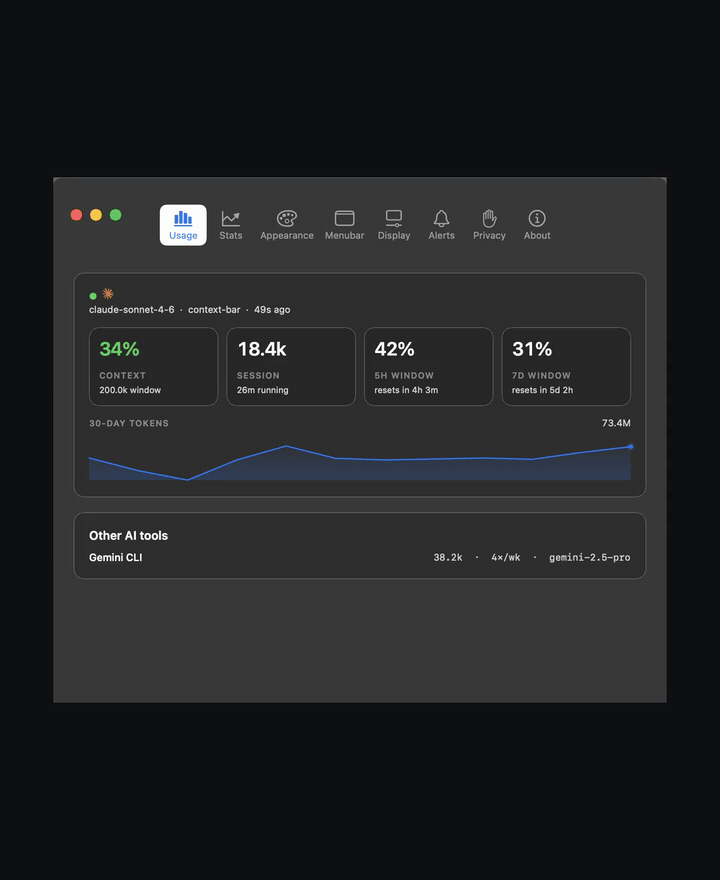
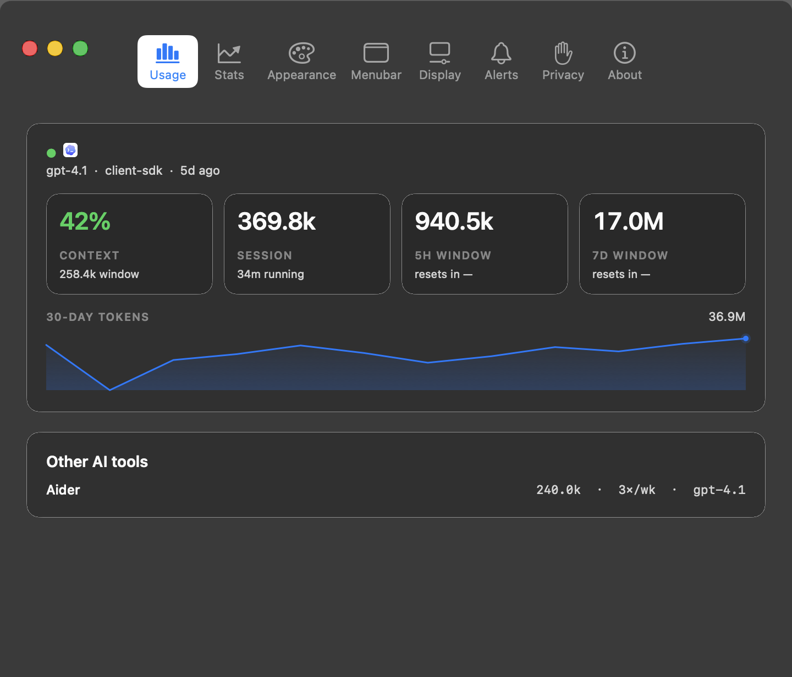
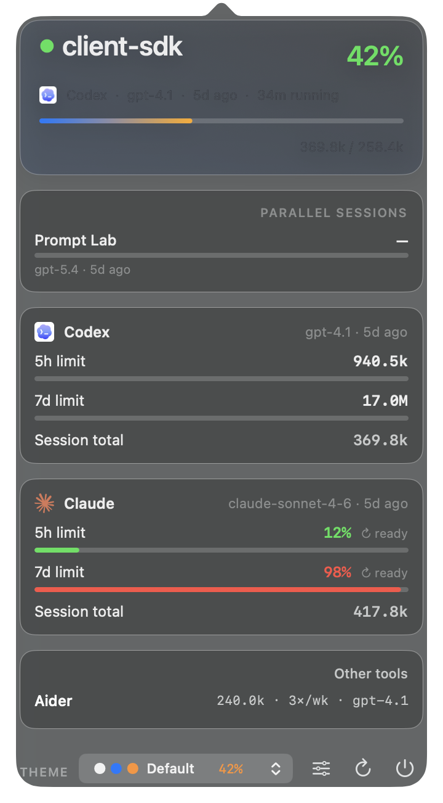
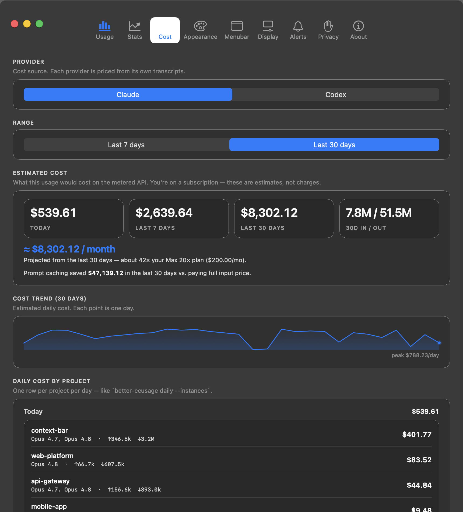
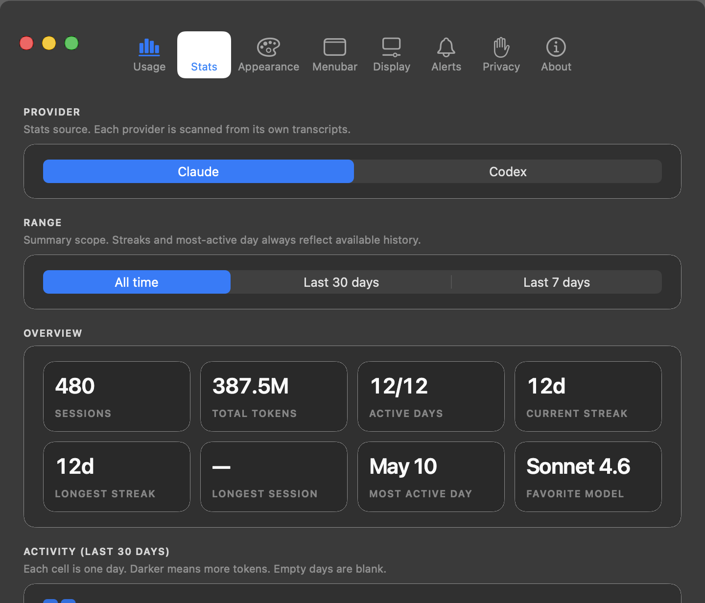

# ContextBar

<p align="center">
  
</p>

<p align="center">
  English | <a href="README.tr.md">Türkçe</a>
</p>

<p align="center">
  <strong>Usage and cost visibility for Claude Code and Codex — a native macOS menubar app and a cross-platform terminal CLI.</strong>
</p>

<p align="center">
  ContextBar shows where your Claude Code and Codex usage is going, on every surface you work from. The <strong>native macOS menubar app</strong> gives you a live session view, rolling 5h/7d limit gauges, cost trends, a WidgetKit widget, and a Share card. The <strong>cross-platform terminal CLI</strong> brings ccusage-class reports (daily / weekly / monthly / session / blocks) and a live TUI dashboard to macOS, Linux, Windows, and SSH — built on a pure-Rust engine, no <code>python3</code> required. Cost numbers are API-equivalent <strong>estimates</strong> priced from the LiteLLM rate table (the same source ccusage uses), not bills. Repository context stays fresh via local snapshots; no external service required.
</p>

<p align="center">
  <a href="https://github.com/htahaozlu/context-bar/releases/latest/download/ContextBar.dmg">
    
  </a>
</p>

<p align="center">
  <strong>Prefer the terminal?</strong> <code>npx context-bar@latest daily</code> · <code>cargo install context-bar</code> — see <a href="#install">Install</a>.
</p>

<p align="center">
  <a href="https://github.com/htahaozlu/context-bar/releases/latest">
    
  </a>
  <a href="https://crates.io/crates/context-bar">
    
  </a>
  <a href="https://www.npmjs.com/package/context-bar">
    
  </a>
  <a href="LICENSE">
    
  </a>
</p>

<p align="center">
  
  
  
  
</p>

## Live demo

<p align="center">
  
</p>

The native macOS app keeps Claude Code and Codex context drift and rolling usage visible while you work; the terminal CLI brings the same usage and cost numbers to any OS, including over SSH.

## Install

ContextBar ships as two products from one release: a **native macOS app** and a **cross-platform terminal CLI**. Pick whichever fits how you work — or use both.

### macOS app — Homebrew (recommended)

The premium, native flagship: a menubar status item, a live AppKit popover, a WidgetKit widget, and a Share card. Requires macOS Ventura (13) or later.

```bash
brew install --cask htahaozlu/context-bar/context-bar
```

`brew` auto-taps `htahaozlu/homebrew-context-bar` on first install. Upgrade later with:

```bash
brew update && brew upgrade --cask htahaozlu/context-bar/context-bar
```

### Terminal CLI (macOS · Linux · Windows)

The cross-platform reach: ccusage-class usage and cost reports plus a live TUI dashboard. Pure-Rust engine — **no `python3` required**. Runs on macOS, Linux (x64/arm64, static musl), and Windows (x64/arm64), including over SSH.

**npm (no install — runs the latest):**

```bash
npx context-bar@latest daily
# also works with other package managers:
bunx context-bar daily
pnpm dlx context-bar daily
```

To install it globally:

```bash
npm install -g context-bar
```

The meta package resolves a prebuilt binary for your platform via an optional dependency (`@htahaozlu/context-bar-<os>-<cpu>`); there is no postinstall, so it works under `npm ci --ignore-scripts`.

**Cargo (crates.io):**

```bash
cargo install context-bar
```

This builds `context-bar` (and its engine, `context-bar-core`) from crates.io.

**Prebuilt binaries (GitHub releases):**

Every [release](https://github.com/htahaozlu/context-bar/releases/latest) attaches a standalone binary for six targets, each with a `.sha256` checksum:

| OS | arch | asset |
| --- | --- | --- |
| macOS | arm64 | `context-bar-aarch64-apple-darwin.tar.gz` |
| macOS | x64 | `context-bar-x86_64-apple-darwin.tar.gz` |
| Linux | arm64 | `context-bar-aarch64-unknown-linux-musl.tar.gz` |
| Linux | x64 | `context-bar-x86_64-unknown-linux-musl.tar.gz` |
| Windows | arm64 | `context-bar-aarch64-pc-windows-msvc.zip` |
| Windows | x64 | `context-bar-x86_64-pc-windows-msvc.zip` |

Download the archive for your platform, verify the checksum, unpack it, and put `context-bar` on your `PATH`. (Linux binaries are statically linked against musl, so they run on any distro.)

### macOS app — direct download (DMG)

If you don't use Homebrew:

1. Download `ContextBar.dmg` from the [latest release](https://github.com/htahaozlu/context-bar/releases/latest) (universal: Apple Silicon + Intel).
2. Drag `ContextBar.app` into `Applications`.
3. Launch it. The app is **signed and notarized by Apple**, so it opens without a quarantine warning.
4. Eject and delete the DMG.

## Preview

<p align="center">
  
</p>

Native macOS usage window with rolling session visibility for Claude Code and Codex.

<p align="center">
  
</p>

Compact menubar status item showing active agent, project, and context usage. Clicking it opens a native popover with the active session, context window, rolling 5h/7d limits, parallel sessions, and a live theme picker.

<p align="center">
  
</p>

The **Cost** tab estimates what your subscription usage would cost on the metered API — per day, per project, for Claude and Codex — and projects it against your plan price (e.g. *"~41× your Max 20× plan"*). It replicates `better-ccusage daily --instances` natively, then adds a monthly projection and a cost trend that a CLI can't show passively. Numbers are estimates priced from the LiteLLM rate table (the same source ccusage uses), not bills.

## What it does

ContextBar solves two persistent problems in agent-driven development:

- repository context drifts faster than an agent brief can keep up
- usage and session state stay buried in terminal output and local transcripts

It addresses both through a local pipeline that continuously produces stable project summaries, a cross-platform terminal CLI, and a native macOS HUD for Claude Code and Codex activity.

### Core surfaces

- Cross-platform terminal CLI — `daily` / `weekly` / `monthly` / `session` / `blocks` reports + a live TUI (macOS · Linux · Windows · SSH)
- Native AppKit menubar app (menubar status item, popover, Cost tab, widget, Share card) — macOS
- Estimated API-equivalent cost per day per project (Claude + Codex)
- Repository snapshots under `.context-bar/` with stable `AGENT.md` and `CLAUDE.md`
- Markdown and JSON artifacts for tooling

## How it compares to ccusage

The terminal CLI replicates [ccusage](https://github.com/ryoppippi/ccusage)'s `daily` / `weekly` / `monthly` / `session` / `blocks` reports for both Claude Code and Codex, on a pure-Rust engine (no `python3`), with API-equivalent cost priced from the same LiteLLM rate table. The native macOS app then adds what a passive CLI can't surface: live 5h/7d limit gauges in the menubar, an interactive cost-trend chart, a WidgetKit widget, and a one-click Share card. Use the CLI anywhere; reach for the app on macOS when you want it always-on.

## Key capabilities

### Repository context generation

Each refresh writes agent-readable state into `.context-bar/`:

- `state.json`
- `brief-now.md`
- `brief-session.md`
- `brief-week.md`
- `AGENT.md`
- `hud.md`

For Claude Code compatibility, `CLAUDE.md` is mirrored at the repository root.

### CLI workflow

- `context-bar hud` refreshes the current repository and prints the HUD
- `context-bar snapshot` writes artifacts without printing the HUD
- `context-bar watch 30 .` keeps repository context fresh on an interval
- `context-bar global` builds a cross-project HUD under `~/.context-bar/`

### Native macOS companion

The companion app reads `~/.context-bar/context.json` (`hud.json` before v0.3.13) and provides:

- a compact menubar status item (active agent + project + context %)
- a modern AppKit popover with cards for the active agent, context window,
  rolling 5h/7d limits with progress bars, parallel sessions, and other
  detected AI tools
- a theme picker with inline color swatches and live preview — hover a
  theme and the menubar title repaints in that palette before you commit
- three data views (Usage, Stats, Cost) plus a clean, Apple-style settings set (General · Appearance · Privacy) and About
- per-session context percentage for parallel Claude / Codex sessions

### Estimated cost & plan value

The **Cost** tab answers a question subscription users increasingly ask — *"what would this cost if I were forced onto the metered API?"*

- per-day, per-project cost breakdown (the native equivalent of `better-ccusage daily --instances`), for both Claude and Codex
- estimated cost for today / last 7 days / last 30 days, plus 30-day input vs. output token totals
- a **monthly projection** compared to your actual plan price (e.g. *"≈ $8,268/mo — about 41× your Max 20× plan"*)
- an interactive 30-day cost-trend chart — hover any day for its date, estimated cost, and tokens
- priced **per turn by model** from the LiteLLM rate table (the same canonical source ccusage uses), fetched live with a 24h on-disk cache and a bundled offline fallback; Anthropic's prompt-cache and >200K long-context rules are honored
- everything is clearly labelled an **estimate** — subscription plans are not billed per token. Set `CONTEXTBAR_PRICING_OFFLINE=1` to skip the live rate fetch.

### Desktop & Notification Center widget

ContextBar ships with a native WidgetKit extension in three sizes —
`systemSmall`, `systemMedium`, and `systemLarge`. The widget reads the same
`context.json` as the menubar via a shared App Group container
(`DQJT5BCZCM.com.htahaozlu.contextbar`), so it always reflects the active
agent, project, model, context %, rolling 5h/7d limits, and a per-agent
breakdown without any extra daemon.

<p align="center">
  
</p>

To add it:

1. Install ContextBar 0.3.12 or later and launch it once so macOS indexes
   the extension (`pluginkit -m -v -i com.htahaozlu.contextbar.widget`
   should list it).
2. Open Notification Center (click the clock) → **Edit Widgets**, or
   right-click the desktop → **Edit Widgets**.
3. Search for **ContextBar**, then drop the small / medium / large variant
   wherever you want.

The widget extension is sandboxed and signed with the App Group entitlement,
which is required by `chronod` on macOS 14+ (the previous unsandboxed bundle
was silently rejected with `Ignoring restricted or unknown extension`).
The host menubar app mirrors `~/.context-bar/context.json` into the App Group
container on every refresh so the sandboxed widget can read it.

### Share Today's HUD

The popover footer has a **Share** button (`square.and.arrow.up`) that
renders the current HUD as a PNG share card — active agent, model, context
%, 5h/7d usage, and other detected tools — masked by default so project
names are not leaked. The image is saved to a temporary path and opened in
Preview / a save dialog so you can drop it into Slack, X, or a status
thread without screenshotting and cropping.

<p align="center">
  
</p>

Headless render (no UI) for automation:

```bash
CONTEXTBAR_SHARE_RENDER_PATH=/tmp/hud.png \
CONTEXTBAR_SHARE_MASK=1 \
/Applications/ContextBar.app/Contents/MacOS/context-bar
```

Set `CONTEXTBAR_SHARE_MASK=0` to keep real project names in the card.

If the menubar icon is hidden by overflow (Bartender, Hidden Bar, or a
crowded menubar), launching ContextBar again from Finder / Spotlight opens
the Settings window directly so you can still reach preferences.

The desktop UI is native AppKit (NSPopover + NSVisualEffectView, continuous
corner curves, SF Symbol toolbar). `detail.html` is an export artifact, not
the primary app experience.

## Usage

### Refresh the current repository

```bash
context-bar hud
```

### Write artifacts without printing the HUD

```bash
context-bar snapshot
```

### Keep repository context fresh

```bash
context-bar watch 30 .
```

### Generate the global HUD

```bash
context-bar global
context-bar watch-global 30
```

The global HUD is written to `~/.context-bar/hud.md`.

## Terminal CLI

The terminal CLI is built on the same pure-Rust cost engine that powers the macOS app (which remains the premium flagship). It runs on macOS, Linux, and Windows (arm64 + x64), needs no `python3`, works over SSH, and installs via `npx context-bar`, `cargo install context-bar`, or a prebuilt binary. Report verbs render `ccusage`-style tables for Claude Code and Codex usage.

### Report verbs

- `context-bar daily` — per-day usage + cost table (Claude + Codex), grouped with an "All" row, per-agent sub-rows, and a Total row
- `context-bar weekly` — per-ISO-week table
- `context-bar monthly` — per-month table
- `context-bar session` — recent sessions table
- `context-bar blocks` — active 5h block per agent: usage % of limit, burn rate ($/hr · tok/min), projected total, reset countdown, ETA-to-limit
- `context-bar live` — the same 5h-block burn metrics as an auto-refreshing terminal dashboard (`ratatui`): a color-tiered gauge per agent, refreshing every `--interval` seconds; `q` to quit, `r` to refresh now. Works over SSH and on Linux/Windows.

### Report flags

- `--instances` — split the daily table by project (per day × project)
- `--breakdown`, `-b` — also print a per-model breakdown table
- `--agent <claude|codex|all>` — restrict to one agent (default: `all`)
- `--since <YYYYMMDD>` / `--until <YYYYMMDD>` — inclusive date filter
- `--json` — emit the report as JSON (for piping / `jq`)
- `--offline` — skip the live pricing fetch (cached / bundled rates)
- `--lang <en|tr>` — force UI language (default: locale; tables and headers are fully bilingual EN/TR)
- `--no-color` — disable ANSI color (also auto-off when piped or `NO_COLOR` is set)

The engine verbs `hud`, `snapshot`, `global`, `claude-statusline`, `watch`, `watch-global`, and `--version` are unchanged.

### Example

```
Coding Agent Usage Report — Daily
| Date       | Agent      | Models            | Input   | Output    | Cache Create | Cache Read    | Total         | Cost (USD) |
| 2026-05-29 | All        | opus-4-8, gpt-5.5 | 937,053 | 5,372,832 | 17,259,276   | 997,890,608   | 1,021,459,769 | $746.00    |
|            |   - Claude | opus-4-8          | 652,442 | 5,336,901 | 17,259,276   | 995,772,208   | 1,019,020,827 | $742.44    |
|            |   - Codex  | gpt-5.5           | 284,611 | 35,931    | 0            | 2,118,400     | 2,438,942     | $3.56      |
| Total      |            |                   | ...     | ...       | ...          | ...           | ...           | $1,682.65  |
```

In the real terminal these are Unicode box-drawing tables via `comfy-table`. `Total` follows `ccusage`'s Total Tokens — `input + output + cache_creation + cache_read`. Costs are **estimates** of what the metered API would charge, not a bill — subscription users aren't billed per token.

## Artifact layout

Each refresh writes the following files atomically:

- `.context-bar/state.json`
- `.context-bar/brief-now.md`
- `.context-bar/brief-session.md`
- `.context-bar/brief-week.md`
- `.context-bar/AGENT.md`
- `.context-bar/hud.md`
- `CLAUDE.md`

Atomic writes ensure agents do not observe partial state during refresh.

## Data sources

ContextBar combines:

- Git branch, recent commits, and worktree status
- file activity inferred from repository mtimes
- optional Claude Code statusline snapshot from `~/.context-bar/claude-statusline.json`
- Claude Code usage from `~/.claude/projects/**/*.jsonl`
- Codex CLI usage from `~/.codex/sessions/**/*.jsonl`

No external service is required for the core repository summaries. Usage aggregation relies on locally available transcripts and optional native Claude Code statusline data, parsed by a pure-Rust cross-platform engine (no `python3`).

### Claude Code parity

For Claude context percentage, the best source is Claude Code's native statusline payload. ContextBar can persist that payload locally:

```json
{
  "statusLine": {
    "type": "command",
    "command": "context-bar claude-statusline"
  }
}
```

This writes `~/.context-bar/claude-statusline.json`, which ContextBar reads as the primary Claude context source. If the snapshot is missing or stale, ContextBar falls back to transcript-based estimation.

## Packaging

The repository includes scripts for the macOS companion build:

```bash
scripts/build-menubar-app.sh
scripts/create-macos-dmg.sh
```

To include the WidgetKit extension in a direct app build:

```bash
WIDGET_BUILD=1 scripts/build-menubar-app.sh
```

`scripts/create-macos-dmg.sh` enables the widget build by default.

Artifacts:

- `dist/ContextBar.app`
- `dist/ContextBar.dmg`

## Repository layout

- `src/` core engine, artifact rendering, and usage aggregation
- `src/bin/context-bar.rs` standalone CLI entry point
- `menubar/context-bar.swift` macOS companion app
- `examples/snapshot.rs` native development harness

## Development

```bash
cargo check
cargo run --example snapshot
```

## Community

- Questions and usage help: GitHub Discussions
- Bugs and feature requests: GitHub Issues
- Contribution guide: `CONTRIBUTING.md`
- Security reporting: `SECURITY.md`

## License

Apache-2.0
