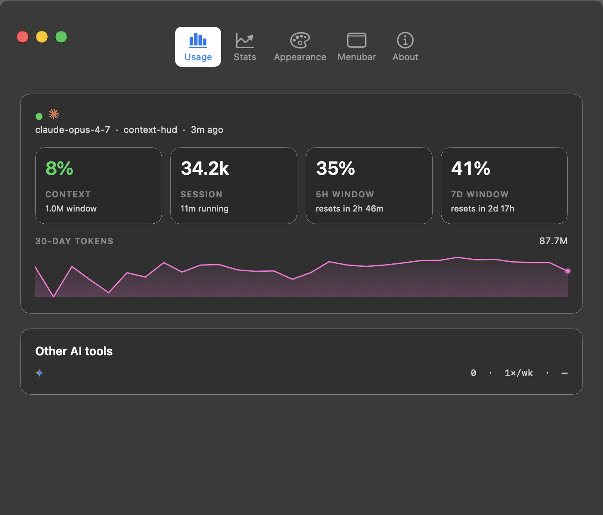
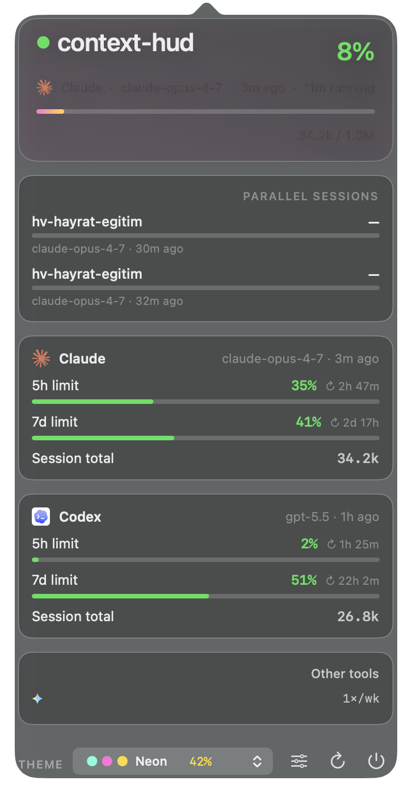

# ContextHUD

<p align="center">
  
</p>

<p align="center">
  <a href="README.md">English</a> | Türkçe
</p>

<p align="center">
  <strong>Kodlama ajanları için local-first depo bağlamı ve yerel macOS kullanım görünürlüğü.</strong>
</p>

<p align="center">
  ContextHUD, ajanların çalıştıkları depoya bağlı kalmasını sağlar, ajanların okuyabileceği kararlı özetler üretir ve Claude Code ile Codex kullanımını yerel bir macOS arayüzüyle görünür hale getirir.
</p>

<p align="center">
  <a href="https://github.com/htahaozlu/context-hud/releases/latest/download/ContextHUD.dmg">
    
  </a>
  <a href="https://github.com/htahaozlu/context-hud/releases/latest">
    
  </a>
  <a href="LICENSE">
    
  </a>
  
  
</p>

## Kurulum

### Homebrew (önerilen)

```bash
brew install --cask htahaozlu/context-hud/context-hud
```

`brew` ilk kurulumda `htahaozlu/homebrew-context-hud` tap'ini otomatik ekler. Sonraki güncellemeler: `brew upgrade --cask context-hud`.

### macOS uygulaması (DMG)

1. [En son sürümden](https://github.com/htahaozlu/context-hud/releases/latest) `ContextHUD.dmg` dosyasını indirin (evrensel: Apple Silicon + Intel).
2. `ContextHUD.app` uygulamasını `Applications` klasörüne sürükleyin.
3. İlk açılış: `ContextHUD.app` üzerine sağ tıklayın → **Aç** → tekrar **Aç**. Uygulama ad-hoc imzalı (notarize değil).
4. DMG'yi çıkarıp silin.

macOS uygulamayı "hasarlı" olarak gösterirse quarantine işaretini kaldırın:

```bash
xattr -dr com.apple.quarantine /Applications/ContextHUD.app
```

### CLI

```bash
cargo install --path .
```

## Önizleme

<p align="center">
  
</p>

Claude Code ve Codex için sürekli oturum görünürlüğüne sahip yerel macOS kullanım penceresi.

<p align="center">
  
</p>

Aktif ajan, proje ve bağlam kullanımını gösteren kompakt menubar durum öğesi.

## Ne işe yarar

ContextHUD, ajan destekli geliştirmede sürekli tekrar eden iki sorunu hedefler:

- depo bağlamı, ajan özeti güncellenmeden daha hızlı değişir
- kullanım ve oturum durumu terminal çıktısı ile yerel kayıtlar arasında kaybolur

Bu iki problemi, sürekli kararlı proje özetleri üreten yerel bir işlem hattıyla ve Claude Code ile Codex etkinliğini gösteren yerel bir macOS HUD arayüzüyle çözer.

### Temel yüzeyler

- `.context-hud/` altında depo snapshot'ları
- Kararlı `AGENT.md` ve `CLAUDE.md`
- refresh, watch ve global görünümler için CLI
- Yerel AppKit menubar yardımcı uygulaması
- Araçlar için Markdown ve JSON çıktıları

## Temel yetenekler

### Depo bağlamı üretimi

Her yenileme, ajanların okuyabileceği durumu `.context-hud/` altına yazar:

- `state.json`
- `brief-now.md`
- `brief-session.md`
- `brief-week.md`
- `AGENT.md`
- `hud.md`

Claude Code uyumluluğu için `CLAUDE.md`, depo köküne de aynalanır.

### CLI iş akışı

- `context-hud hud` mevcut depoyu yeniler ve HUD çıktısını basar
- `context-hud snapshot` HUD basmadan artifact yazar
- `context-hud watch 30 .` depo bağlamını belirli aralıklarla taze tutar
- `context-hud global` `~/.context-hud/` altında projeler arası HUD oluşturur

### Yerel macOS yardımcısı

Yardımcı uygulama `~/.context-hud/hud.json` dosyasını okur ve şunları sağlar:

- kompakt bir menubar durum görünümü
- Claude Code ve Codex için yerel kullanım penceresi
- tema, dil ve menubar başlık birleşimi ayarları

Masaüstü arayüzü yerel AppKit ile yazılmıştır. `detail.html`, ana deneyim değil, bir export artifact'idir.

## Kullanım

### Mevcut depoyu yenile

```bash
context-hud hud
```

### HUD yazdırmadan artifact üret

```bash
context-hud snapshot
```

### Depo bağlamını taze tut

```bash
context-hud watch 30 .
```

### Global HUD üret

```bash
context-hud global
context-hud watch-global 30
```

Global HUD `~/.context-hud/hud.md` konumuna yazılır.

## Artifact düzeni

Her yenileme aşağıdaki dosyaları atomik olarak yazar:

- `.context-hud/state.json`
- `.context-hud/brief-now.md`
- `.context-hud/brief-session.md`
- `.context-hud/brief-week.md`
- `.context-hud/AGENT.md`
- `.context-hud/hud.md`
- `CLAUDE.md`

Atomik yazım sayesinde ajanlar yenileme sırasında yarı yazılmış durumu görmez.

## Veri kaynakları

ContextHUD şu kaynakları birleştirir:

- Git branch, son commit'ler ve worktree durumu
- depo `mtime` verilerinden çıkarılan dosya etkinliği
- `~/.claude/projects/**/*.jsonl` içinden Claude Code kullanım verisi
- `~/.codex/sessions/**/*.jsonl` içinden Codex CLI kullanım verisi

Temel depo özetleri için harici servis gerekmez. Kullanım toplama, yerel transcript verilerine ve `python3` aracına dayanır.

## Paketleme

Depoda macOS yardımcı uygulaması derlemesi için scriptler bulunur:

```bash
scripts/build-menubar-app.sh
scripts/create-macos-dmg.sh
```

Artifact'ler:

- `dist/ContextHUD.app`
- `dist/ContextHUD.dmg`

## Depo düzeni

- `src/` çekirdek motor, artifact render etme ve kullanım toplama
- `src/bin/context-hud.rs` bağımsız CLI giriş noktası
- `menubar/context-hud.swift` macOS yardımcı uygulaması
- `examples/snapshot.rs` yerel geliştirme harness'i

## Geliştirme

```bash
cargo check
cargo run --example snapshot
```

## Topluluk

- Sorular ve kullanım yardımı: GitHub Discussions
- Hatalar ve özellik istekleri: GitHub Issues
- Katkı rehberi: `CONTRIBUTING.md`
- Güvenlik bildirimi: `SECURITY.md`

## Lisans

Apache-2.0
